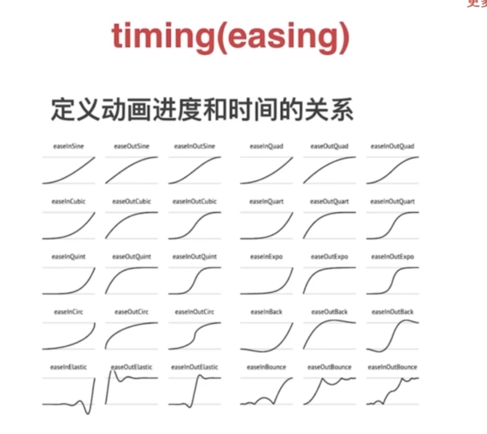
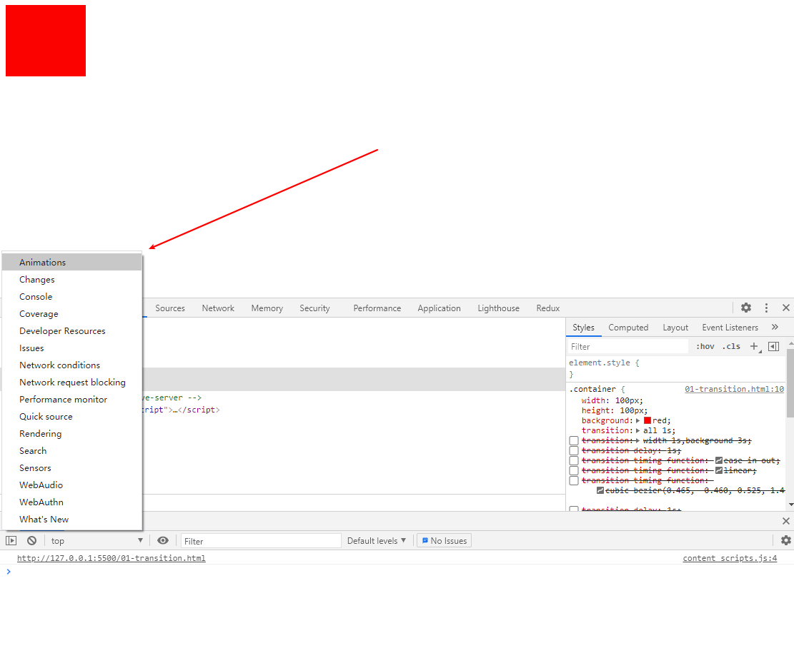
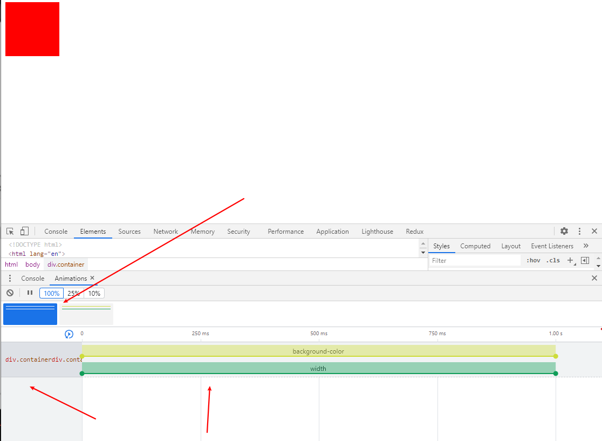
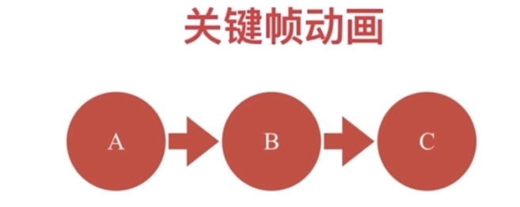

# CSS动画

## 动画原理
1. 视觉暂留作用
2. 画面逐渐变化

## 动画的作用
1. 愉悦感
2. 引起注意
3. 操作反馈
4. 操作掩饰

## CSS中的动画类型
1. transition 补间动画
2. keyframe 关键帧动画
3. 逐帧动画

## 补间动画
* Flash和CSS动画原理挺像的
* "创建补间动画"前后都有一个"黑点",起始状态和最终状态,中间的过程都是Flash算出来的
* 具体而言，它需要要算中间过程，就不能所有的全部去算
  * display: block 和 none中间是从0到1或者从有到无，中间的渐变是没法算的
* 所以只能计算一部分属性
  * 位置 - 平移(left/right/margin/transform)
  * 方位 - 旋转(transform，可以把中间的角度作为一个变化)
  * 大小 - 缩放(transform)
  * 透明度(opacity)
  * 其他 - 线性变换(transform)
    * 除了 translate rotate scale skew 之外呢还有上面几个通用的线性变化(线性变换的特例) 也可以组合
    * 组合之后也是线性变换，但是从一个圆变换矩形..就不是线性变换了
## timing调速(easing放松策略)

## chrome动画面板
* F12 -> Esc

* 点击其中一个动画，图表的高度就是(随着时间变化的，属性变化的速度)，X轴是时间， 还可以拖动(起始)调试

## 详细在demo.html里

## 关键帧动画(animation)
* 什么叫关键帧动画？

* 指定一个动画里面的关键"路径"，比如说定ABC三个动画的状态，AB,BC之间由CSS自动计算 
* 相当于多个"补间动画"组合到一起了
* 与元素状态的变化无关
  * 要么是hover要么加一个class，setTimeout..元素的状态要有变换
  * 关键帧动画不要求元素有变化
  * 定义更加灵活

## 逐帧动画
* 就是每一帧都是一个关键帧
* 中间没有补间过程
  * 上面的例子AB,BC之间是有一些补间的
* 逐帧动画还是使用@keyframes定义(关键帧)
  * 只是关键帧的特殊用法
  * 适用于无法补间计算的动画
  * 资源较大(例如需要很多图片来实现动画)
  * 使用setps()

## 3d先看看就行，另一个css模块学习